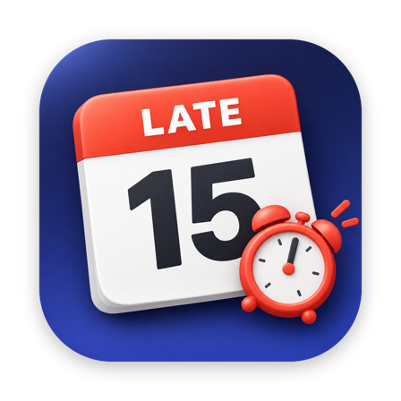

<div align="center">



<h1>Tardy</h1>

<p>
A macOS menu bar app that makes meetings impossible to miss. Tardy watches the calendars in the
Mac Calendar app and escalates as a meeting gets closer, from a quiet dot to a flashing
<b>LATE</b> counter, with one-click join for Zoom, Teams, Google Meet and more.
</p>

<a href="LICENSE"></a>


</div>

## Table of Contents

- [Overview](#overview)
- [Quick Install](#quick-install)
- [Features](#features)
- [Supported Meeting Providers](#supported-meeting-providers)
- [Usage](#usage)
- [Documentation](#documentation)
- [Contributing](#contributing)
- [License](#license)

## Overview

Calendar alerts on macOS, iOS and Apple Watch all look and sound the same, and
they are easy to swipe away. A meeting 15 minutes out gets the same treatment as
one starting in 30 seconds.

Tardy escalates instead. The menu bar shows today's date and a dot for your next
meeting, adds the time as it approaches, plays a sound and posts a notification
at 15 and 5 minutes, runs a live countdown, beeps at one minute, and flashes a
LATE counter once the meeting has started until you join or dismiss it.

> [!IMPORTANT]
> **Tardy works with the native Mac Calendar app.** It reads events through
> macOS's calendar store, so every calendar you want watched (iCloud, Google,
> Exchange/Microsoft 365, CalDAV, subscriptions) must be added to Calendar.app
> first: **Calendar > Settings > Accounts**. Calendars that only live in a web
> app or another calendar client are invisible to Tardy.

Everything runs locally. Tardy makes no network calls except checking
`tardy.vpetkov.net` for app updates.

## Quick Install

```bash
curl -fLO https://tardy.vpetkov.net/Tardy.dmg
open Tardy.dmg
# Drag Tardy to Applications, then launch it and allow Calendar access
```

Requires macOS 14 (Sonoma) or later. The app is signed and notarized by Apple.
To build from source, see [docs/DEVELOPING.md](docs/DEVELOPING.md).

## Features

- **Escalating alerts:** a sound and a notification at 15 and 5 minutes, a live countdown from 5 minutes, beeps at 1 minute, and a flashing LATE counter that auto-clears after 5 minutes
- **Live date icon:** today's weekday and date, plus a red (personal) or blue (work) dot for your next meeting
- **One-click join:** a large Join button when a meeting with a link is close, or click any meeting in the list
- **Meeting list:** Now / Starts in … / Later today, with each meeting's time and provider
- **Work and Personal calendars:** mark each calendar Work or Personal; the dot colors follow
- **Settings window** with import and export, so a setup moves between Macs in one file
- **Menu bar clock:** optional, with seconds, AM/PM, 24-hour time, day and date; the dropdown always shows a live clock
- **Keyboard shortcut:** ⇧⌘M opens and closes the menu from anywhere; change it in Settings > Shortcuts
- **Light on battery:** wakes only when something on screen needs to change, and refreshes when your calendars change instead of polling
- **Automatic updates** through [Sparkle](https://sparkle-project.org)

## Supported Meeting Providers

Tardy finds a meeting link in an event's location, URL or notes (in that order)
and recognizes these providers:

| Provider | Example link |
|---|---|
| Zoom (including ZoomGov) | `https://company.zoom.us/j/123456789` |
| Microsoft Teams (work and personal) | `https://teams.microsoft.com/l/meetup-join/…` |
| Google Meet | `https://meet.google.com/abc-defg-hij` |
| Webex | `https://company.webex.com/meet/name` |
| GoTo Meeting | `https://meet.goto.com/123456789` |
| Amazon Chime | `https://chime.aws/1234567890` |
| Slack Huddles | `https://app.slack.com/huddle/…` |
| Whereby | `https://whereby.com/room` |
| Jitsi Meet | `https://meet.jit.si/room` |
| Discord | `https://discord.gg/invite` |
| RingCentral Video | `https://v.ringcentral.com/join/…` |
| Zoho Meeting | `https://meeting.zoho.com/…` |

Only `https://` links are ever opened. A meeting without a recognized link still
gets every alert; clicking it opens Calendar.

## Usage

| Menu bar | When | Sound | Notification |
|---|---|---|---|
| `[WED 16] ●` | Next meeting more than 30 min away | | |
| `[WED 16] ● 2:30-3:00pm` | Within 30 min | | |
| `[WED 16] 12m - Standup` | 15 min | Sonar | "Meeting in 15 minutes" |
| `🔴 4:59 - Standup (until 3:00pm)` | 5 min, live countdown | Sonar | "Meeting in 5 minutes" |
| `🔴 0:42 - Standup` | 1 min | 3 beeps | |
| `⚠ LATE 1:23` (flashing) | Started | | |

- **Click** the icon for today's meetings, Join and Dismiss, Mute Sounds and **Settings…** (⌘,).
- **Settings** has panes for General (mute, launch at login), Calendars (watch each one,
  Personal or Work), Clock, Shortcuts, Updates, and Import & Export.
- **⇧⌘M** (configurable) toggles the menu. Leave it open to watch the live clock.

Settings can be exported to a file and imported on another Mac; see
[docs/CONFIGURATION.md](docs/CONFIGURATION.md).

## Documentation

- [docs/CONFIGURATION.md](docs/CONFIGURATION.md): every setting and its `defaults` key
- [docs/DEVELOPING.md](docs/DEVELOPING.md): building, signing, notarizing, releasing and updates
- [docs/ARCHITECTURE.md](docs/ARCHITECTURE.md): how alerts, scheduling and the menu work, and the macOS pitfalls behind them

## Contributing

Issues and pull requests are welcome. See [CONTRIBUTING.md](CONTRIBUTING.md).

## License

[MIT](LICENSE) © Ventz Petkov
