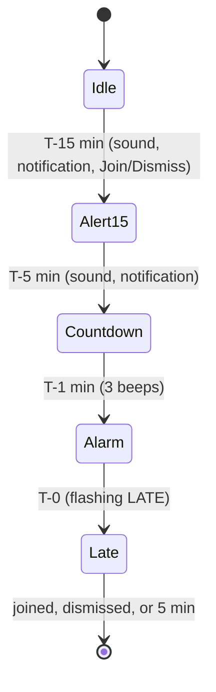

# Architecture

## Table of Contents

- [Layout](#layout)
- [Alert state machine](#alert-state-machine)
- [Scheduling](#scheduling)
- [The menu bar item](#the-menu-bar-item)
- [The menu](#the-menu)
- [Cmd+Shift+M](#cmdshiftm)
- [Pitfalls](#pitfalls)

## Layout

| Path | Role |
|---|---|
| `Sources/TardyCore/` | Pure logic, no AppKit: `AlertState`, `TickScheduler`, `Formatting`, `MeetingLinks`, `ClockOptions`, `HotKeyShortcut`, `SettingsSnapshot` (export format and cross-Mac calendar matching). Covered by `Tests/TardyCoreTests`. |
| `Sources/Tardy/AppController.swift` | Status item, per-meeting state machine, tick timer, menu and actions |
| `Sources/Tardy/CalendarService.swift` | EventKit: access, calendar groups, today's meetings |
| `Sources/Tardy/MenuRows.swift` | Menu rows: meeting rows, clock header, Join/Dismiss/LATE styles |
| `Sources/Tardy/SettingsWindow.swift` | SwiftUI Settings window (sidebar panes) and the import/export/reset panels |
| `Sources/Tardy/StatusImage.swift` | The drawn date icon and meeting dot |
| `Sources/Tardy/HotKey.swift` | Carbon global hotkey with suspend/resume |
| `Sources/Tardy/AlertPlayer.swift` | Sounds (Sonar) and user notifications |
| `Sources/Tardy/Updater.swift` | Sparkle |
| `Sources/Tardy/Settings.swift` | `SettingsStore` (observable, UserDefaults-backed) and `CalendarDirectory` |

## Alert state machine

Each meeting has its own state; the highest-priority one (then the soonest) drives the
menu bar.

Entry actions fire once per meeting per state (`entered`). Joining or dismissing adds
the meeting to `dismissed`, which is pruned whenever events are refetched.

## Scheduling

There is no repeating timer. Each tick schedules the next one-shot `Timer` from
`TickScheduler.nextDelay`:

- **1 second**, aligned to the second: a meeting is within 15 minutes or LATE, the menu is
  open (live clock), or the menu bar clock shows seconds.
- **Otherwise** it sleeps until the next moment the display changes: T-30 (time appears),
  T-15, a meeting start, midnight, or the next clock minute. The longest gap is 10 minutes.

Timers run in `RunLoop.Mode.common` so the countdown keeps going while the menu is open,
with a 10% tolerance so macOS can coalesce wakeups.

Events are refetched on `EKEventStoreChanged`, wake from sleep, timezone change and day
change, with a 10-minute safety refetch. Timers don't count system sleep, so the wake
notification matters.

## The menu bar item

- **Date icon:** the 📅 emoji is not usable; Apple's glyph always reads "JUL 17".
  `StatusImage` draws a solid page with the weekday and day cut out.
- **The dot is part of the same image,** not the button title. Text glyphs and even
  vertically centered text attachments overlapped the icon's corner in the real status
  bar while looking correct when rendered offscreen. Because the image carries color, it
  is not a template image; the ink follows the menu bar appearance explicitly and is
  redrawn only when day, dot, visibility or appearance changes.
- **The clock text** sits after the icon only in icon states (idle and T-15); the red
  countdown and LATE states hide icon, dot and clock.

## The menu

- **Meeting rows** are native `NSMenuItem`s with a two-line attributed title: dot, tab,
  title, then U+2028 and a gray detail line. U+2028 keeps one paragraph so `headIndent`
  lines the detail up under the title; `\n` would start a new paragraph.
- **Settings live in a SwiftUI window** (Settings…, ⌘,), not the menu. An earlier design put
  them in a Cmd/Option-click submenu, which needed view-based checkbox rows because a standard
  menu item always closes the menu on click.
- **One observable `SettingsStore`** feeds both the window and the menu bar. `AppController`
  subscribes to `objectWillChange` and applies on the next run loop pass (the event fires
  before the new value lands): mute, clock format, dot colors, and a refetch only when the
  watched calendars changed.
- **The meeting list is rebuilt on every open** so "Starts in …" is current.

## Cmd+Shift+M

The shortcut is configurable (Settings > Shortcuts, `HotKeyShortcut` in TardyCore); ⇧⌘M is the default.

A Carbon `RegisterEventHotKey` hotkey needs no Accessibility permission. Getting it to
*close* the menu took several attempts:

1. **A registered hotkey is swallowed system-wide,** and its event is delivered only after
   menu tracking ends. While the menu is open, neither the app nor the menu sees the press.
   `menuWillOpen` suspends the hotkey (unregisters it) and `menuDidClose` resumes it.
2. **With the hotkey suspended,** a hidden menu item with the same key equivalent
   (`allowsKeyEquivalentWhenHidden`) receives the key and closes the menu. A local keyDown
   event monitor does not fire during menu tracking.
3. **Never call `performClick` inside the hotkey handler.** It blocks for as long as the
   menu is open, which queues the closing press; the menu is opened with
   `perform(_:with:afterDelay: 0)` instead.
4. **A press within 0.5 seconds of a close is ignored** as a guard against reopening.
5. **Recording a new shortcut suspends the live hotkey** for the same reason as (1): otherwise
   pressing the current combination in the recorder is swallowed. The hidden Close Menu item's
   key equivalent is kept in step with whatever shortcut is registered.

## Pitfalls

- **Hardened runtime needs `com.apple.security.personal-information.calendars`** or EventKit
  access fails silently. `scripts/release.sh` refuses to publish without it.
- **Recurring events share an `eventIdentifier`,** so a meeting's ID also includes its start time.
- **Sparkle's `Autoupdate` is a bare executable** that `codesign --verify --deep --strict`
  ignores and notarization rejects if unsigned; every nested Mach-O is signed individually.
- **Never pipe command output into `grep -q` in the scripts.** Under `pipefail` the early exit
  kills the writer with SIGPIPE and fails checks at random; capture into a variable first.
- **Offscreen renders lie** about menu bar and menu layout. Confirm visual changes in the real
  menu bar.
